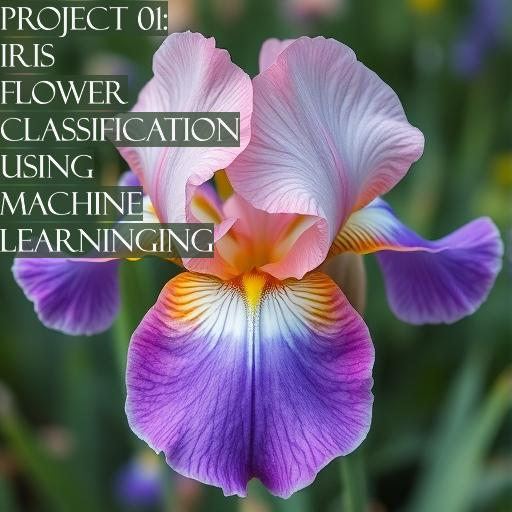

    
  
Install the Data :  
https://github.com/jbrownlee/Datasets/blob/master/iris.csv  
  
The dataset contains information on 150 flowers, which was collected by Edgar Anderson in a CSV file.  
For each flower, the data includes its petal (length and width) and sepal (length and width).  
Copy the Iris.csv file you downloaded to your project folder and start executing the cells in the notebook.  
  
In this project i used the following libraries:    
--> pandas  
--> numpy  
--> matplotlib  
--> seaborn  
--> sklearn  
  
This project has 5 steps :   
1) Load the data
2) Analyze and process the data using different graphs and descriptions  
3) Train the data with different algorithms to determine the best one
4) Evaluate the model
5) Test the model  
The final results of this project are :  
*) Accuracy score = 0.96  
*) Precision  =  0.95  
*) Recall = 0.97  
*) F1 score = 0.96    
